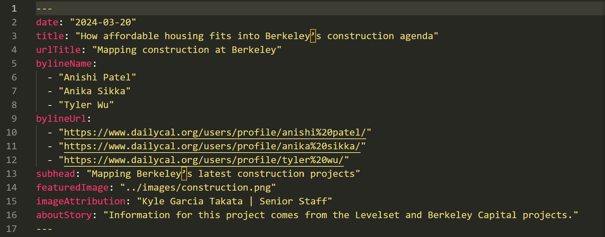
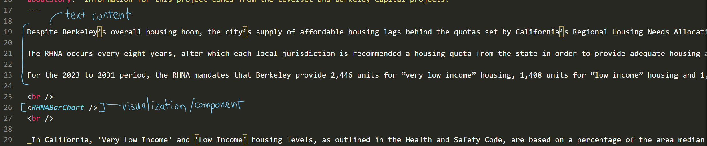
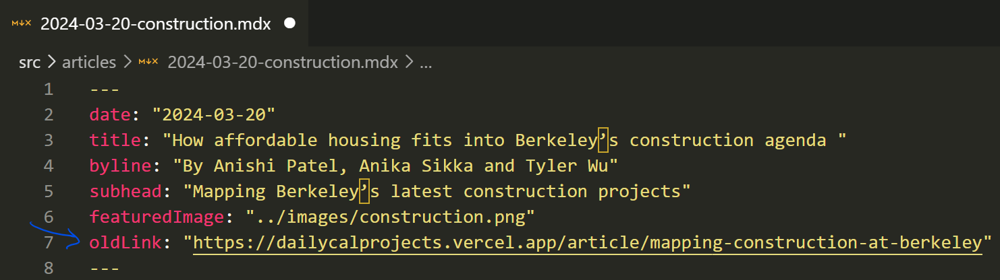

## <a href="https://dailycalprojects.vercel.app/" target="_blank">Live site</a>

## Instructions for DC editors [below](#editor-notes)

## Installation
1) Clone the repository with `git clone https://github.com/tylerwu2222/dailycalprojectsv2.git`
2) If you don't have node + npm you can downloade it here: https://nodejs.org/en/download You can check if node is installed with `node -v`
3) Run `npm run install` in your terminal to install all dependencies

## Getting started

To run the app locally in development mode
1) navigate to the project directory in your terminal
2) run `npm start`
3) Open [http://localhost:3000](http://localhost:3000) in your browser to view the app

The page will reload automatically when you make changes.

## Deploying
(NOTE: running `npm run build` isn't necessary with a Vercel app, since Vercel will automatically run the build command when deploying to the live site).

To push your changes to the live site, simply add, commit, and push your changes to the main branch.
You can view changes at the vercel [deployment dashboard](https://vercel.com/tyler-wus-projects/dailycalprojects).

# Editor notes
To check all available commands, run `npm run` in the terminal.

## Creating an article
### `npm run create-article` (WIP)
This script is still WIP, so for now, we have to do some manual work to add a new article 😔:
1) add mdx file to src/articles with the name: `yyyy-mm-dd-article-slug.mdx`
2) add frontmatter to the article, it might looks like this:

3) add text and visualizations below the frontmatter like so:

   
   1) Note that visualization files should use PascalCase notation otherwise `update-articles` will not load the visualization. For example, if a bar chart vis file is named: `DailyCalBarChart.js`, then the exported function should be `DailyCalBarChart`.

## Staging an article
When an article is in-progress, but we want to share with other Projects members or DC departments, we make a private staging link.
To stage an article, add `staging: true` in the front-matter of the mdx file like so:

Then run `npm update articles` (covered below).
### Unstaging
When an article is ready to deploy, simply remove `staging: true` from the front-matter and rerun `npm update articles`

## Updating articles
### `npm run update-articles`
This is a [script]() I wrote to automate the article updating process. It will do two things:
1) It will take the frontmatter info from all the mdx files and store it in the json file, [articlesData.json](https://github.com/tylerwu2222/dailycalprojectsv2/blob/main/src/site_data/articles/articlesData.json). This json file is in turn used to render articles on the home page (or add them to staging, covered later).
2) It will also add imports for the visualizations listed in src/visuals/[`yyyy-mm-dd-article-slug.mdx`]. The imports are needed so that components like `<VisualExportName>` will render in the mdx.

## Adding articles to the old site
If at the time of reading this, Projects is using the Gatsby/netlify app, then you would need to create an mdx file for the article on the old site repository (with just the frontmatter), then include the new site link like so:

## Site structure
### Routes and `<Links/>`
This site uses `react-router-dom` to navigate between pages.
- Article routes (urls) are defined dynamically in App.js
    - Route paths are currently: /article/urlified-title
- Links to article routes wrap around the `<ArticleCard/>` component such that clicking an `<ArticleCard/>`, will navigate to the article page.
  
### Team page
The team page features current and former Daily Cal Projects members.
#### Adding members (WIP)
Members are managed in the [`site_data/membersData.json`](https://github.com/tylerwu2222/dailycalprojectsv2/blob/main/src/site_data/members/membersData.json)

### About page
The about page gives a bit of history behind the Daily Cal's project team!

### Archived functions:
To convert articles from Gatsby to react, run `npm run clean-gatsby`

This project was bootstrapped with [Create React App](https://github.com/facebook/create-react-app).